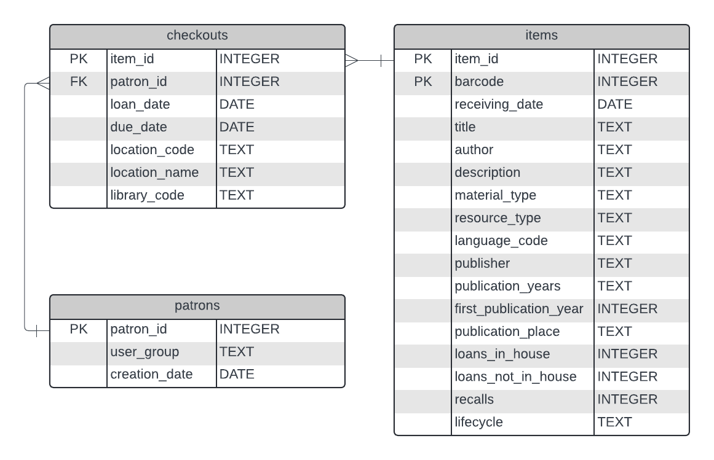

# The Library Checkouts Database

We'll be working with the Library Checkouts Database, a subset of real data from the UC Davis Library. This includes information like:

- Books and their details: title, author, publication year, etc... 
- Patrons who check out items: ID number, what user group they belong to, and the date their library card was created
- Checkouts of books by who and when

Why would a library want to track this information in a database? 

- Data management
    - Centralized location for all data being tracked
    - Computerized and reduces manual processes
- Use SQL to get insight
    - With SQL the library can answer questions like:
      - Which books are being checked out?
      - What types of books are being checked out?
      - Which books are overdue?

## Entity Relationship Diagrams

An **entity relationship diagram** ERD is a visual representation of a
relational database. ERDs help with understanding what data is available, how
the data is stored, and how tables and columns are related. These details are
important for determining what types of questions you can answer with SQL!

Here's an ERD for the Library Checkouts database:

<!-- the loans-in-house is spelled wrong (laons-in-house) -->

Lets break down the components of the ERD:

1.  *Entities*, visualized as a rectangle, represent the tables in the database. The name of the table is written at the top in dark gray.
2.  *Attributes* represent the columns in the database. 
	1.  The names of the columns are written in the middle column.
    1.  *Data Types*: Each attribute is made up of a certain *data type*. The most common data types you'll interact with are numeric, string, date, or boolean. This information is on the right.
    2.  *Primary Key (PK)*: This is a column(s) that uniquely identifies a row in a table. Key designations are written on the left.
    3.  *Foreign Key (FK)*: This is a column that references a primary key. It’s used to identify a relationship between tables.
3.  *Relationships* between tables are represented with lines connecting one entity to another
    1.  The symbols at the end of the lines represent *cardinality*, the number of rows between two database tables.

> **NOTE**:  
> The Library Checkouts ERD was made with the diagramming software [Lucidchart](https://www.lucidchart.com/). Lucidchart also does an excellent job of breaking down Entity Relationship Diagrams [here](https://www.lucidchart.com/pages/er-diagrams).

## Data Definitions

Below are the data definitions of the tables and columns in the Library Checkouts Database.

Table: **patrons**: Users with checkout privileges

| column | description | data type |
| :--- | :--- | :--- |
| patron_id  | unique ID for each user of the library | INTEGER |
| user_group  | the type of borrower - for example, Alumni, Faculty, Undergraduate Students, etc. | TEXT |
| creation_date  | the date lending privileges were created | DATE |

Table: **items**: All the items (books, etc.) in the library system

| column | description | data type |
| :--- | :--- | :--- |
| item_id  | the unique ID for each item | INTEGER |
| barcode  | the barcode for each item | INTEGER |
| receiving_date  | the date the item became a part of the library's collection | DATE |
| title  | the title of the item | TEXT |
| author  | the names of the authors of the item | TEXT |
| description  | additional information about the title | TEXT |
| material_type  | the type of the item (book) | TEXT |
| resource_type  | the type of resource, for example, Book - Physical, Microforms, etc. | TEXT |
| language_code  | a three letter code indicating the language of publication | TEXT |
| publisher  | the name of the publisher | TEXT |
| publication_years  | the years the item was published | TEXT |
| first_publication_year  | the year the work was first published | INTEGER |
| publication_place  | a list of cities the item was published in | TEXT |
| loans_in_house  | number of loans internal to the library | INTEGER |
| loans_not_in_house  | number of loans external to the library | INTEGER |
| recalls  | the number of recalls on an item | INTEGER |
| lifecycle  | if a book is available for circulation | TEXT |

Table: **checkouts**: A log of when a user checks out a book from the library

| column | description | data type |
| :--- | :--- | :--- |
| item_id  | the unique ID for each item | INTEGER |
| patron_id  | unique ID for each user of the library | INTEGER |
| loan_date  | the date the item was checked out | DATE |
| due_date  | the date the item is due | DATE |
| location_code  | a three character code for the location the item can be found | TEXT |
| location_name  | the location the item can be found | TEXT |
| library_code  | a short text code indicating the library that holds the item | TEXT |
