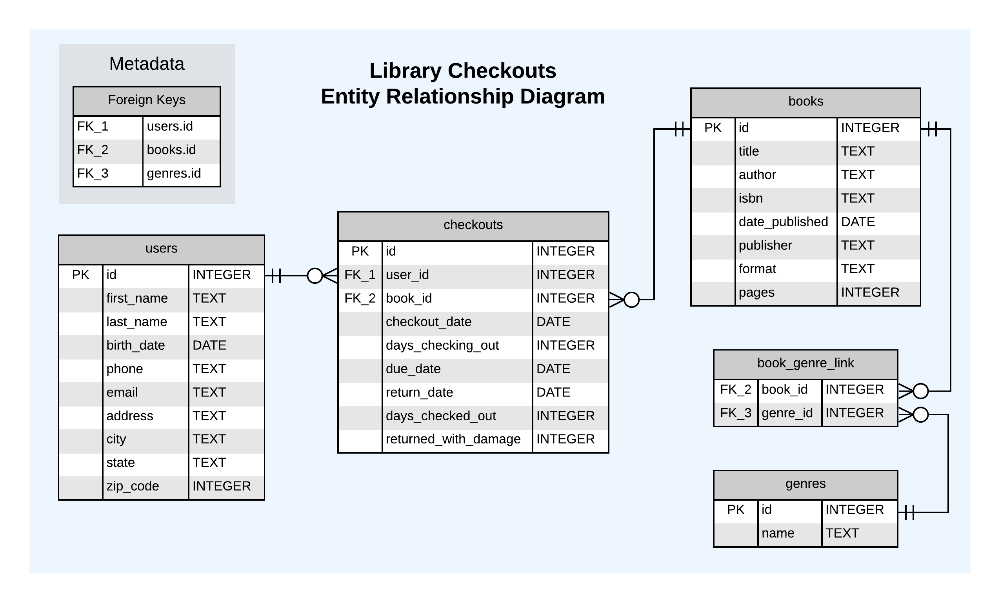

# Hands-On

## Data Background

We'll be working with the Library Checkouts Database, a fictitious dataset about users checking out books from the library. For more detailed information on how it was put together, please refer to the GitHub repository [here](https://github.com/diversifyds/library-checkouts-db).

Although the data is fictious, the database supports enough scenarios for us to learn and practice SQL! 
<!-- *DataLab aims to expand this simulated dataset to a real-world data set based off UC Davis Shields Library.* -->

## SQLiteStudio

[SQLiteStudio](https://sqlitestudio.pl/about/) is a free, open source, multi-platform desktop application for browsing and editing SQLite database files.

### The SQLiteStudio Interface


SQLiteStudio has a number of tools and panes to help you interact with your data. We can view databases (outlined in green) and also write and run queries (outlined in orange).  

### Load the SQL File

1. Click the "Open SQL editor" icon and a new pane will appear. [**1**]
2. Click the "Load SQL from file" icon and the file explorer window will pop up. [**2**]
3. Navigate to the `intro_to_sql_spring22.sql` file on your computer and double-click.

### Load the Database

1. Click the "Add a database" icon and the Database dialog window will pop up. [**3**]
2. Click the "Browse for existing database file on your local computer" icon and the file explorer window will pop up. 
3. Navigate to the  `lcdb.db` file on your computer and double-click. 
4. The Database dialog window will appear again and click the *OK* button.

## Entity Relationship Diagrams

Before we get started with SQL, let's cover what an Entity Relationship Diagram (ERD) is and why it's important. An ERD is simply a visual representation of a database. They help you understand what data is available, how data is stored, and how data is related with one another. Understanding your database means you can determine what types of questions you can answer with SQL!

Below is the Library Checkouts ERD:



Lets break down the components of the ERD:

1.  *Entities* represent the tables in the database.
2.  *Attributes* represent the columns in the database.
    1.  *Data Types*: Each attribute is made up of a certain *data type*. The most common data types you'll interact with are numeric, string, date, or boolean.
    2.  *Primary Key (PK)*: This is a column(s) that uniquely identifies a row in a table.
    3.  *Foreign Key (FK)*: This is a column that references a primary key. It’s used to identify a relationship between tables.
3.  *Relationships* between tables are represented with lines connecting one entity to another
    1.  The symbols at the end of the lines represent *cardinality*, the number of rows between two database tables.

> **NOTE**:  
> Lucidchart does an excellent job of breaking down Entity Relationship Diagrams [here](https://www.lucidchart.com/pages/er-diagrams).

### Data Definitions

Below are the data definitions of the tables and columns in the Library Checkouts DB.

Table: **users**: All users that have an account with the library

| column | description |
| :--- | :--- |
| id  | unique id of the user |
| first_name | first name of the user |
| last_name | last name of the user |
| birth_date | birth date of the user |
| phone | cell phone of the user |
| email | email address of the user |
| address | address where the the user lives |
| city | city where the user lives |
| state | state where the user lives |
| zip_code | zip code where the user lives |

Table: **checkouts**: A log of when a user checks out a book from the library

| column | description |
| :--- | :--- |
| id  | unique id of the book checkout |
| user_id | id of the user who checked out a book |
| book_id | id of the book that was checked out |
| checkout_date | date the book was checked out by the user |
| days\_checking\_out | number of days the user will checkout the book |
| due_date | date the book is due based off days\_checking\_out |
| return_date | date the book was returned by the user |
| days\_checked\_out | number of days the book was checked out for |
| returned\_with\_damage | a number to distinguish whether the book was returned with damage<br>0 = the book was not returned with damage<br>1 = the book was returned with damage |

Table: **books**: All the books in the library inventory system

| column | description |
| :--- | :--- |
| id  | unique id of the book |
| title | title of the book |
| author | name of the author |
| isbn | isbn of the book |
| date_published | date the book was published |
| publisher | publisher of the book |
| format | the format of the book Ex) Hardcover |
| pages | the number of pages the book has |

Table: **book\_genre\_link**: A table to link books with their respective genre(s)

| column | description |
| :--- | :--- |
| book_id | id of the book |
| genre_id | id of the genre |

Table: **genres**: All the genres in the library system

| column | description |
| :--- | :--- |
| id  | unique id of the genre |
| name | name of the genre |


## The SQL Query Blueprint

Today we’ll learn about all the following SQL commands and how they’re used together to view, filter, aggregate, and join data.  

```
SELECT [DISTINCT] ...
FROM ...
[WHERE ...]
    [ [INNER | LEFT] JOIN ...]
[GROUP BY ... [HAVING ...]]
[ORDER BY ...] 
[LIMIT ...];
```

> **NOTE**:
> 
> - Keywords in brackets "[ ]" is optional
> - Write queries in the order of the blueprint
> - End queries with a semicolon ";"

## Viewing Data

### SELECT & FROM

We're ready to write our first query! Type this into the SQL editor pane:

`SELECT * FROM users;`

Place your cursor anywhere on `SELECT` and then click the *Execute query* button. 

This is the most common query you'll write as you start exploring your data. `SELECT` is used to display the columns of tables you want and `FROM` is used to specifiy which table to get the columns from.

The query asks the database to select everything (* means "everything") from the table *users*. It ends with a semicolon to tell the database that this is the end of the request.

The below query does exactly the same thing as the first one, hence the need for the end of query indicator. We can use new lines to help us organize queries to make them easier to read.

```
SELECT * 
FROM users;
```

> **NOTE**:  
> Capitalization in queries follows some best practices:
> 
> - SQL commands are in all caps
> - Table names and column names are all lowercase


### Selecting Columns

What if we don't want to see all of the columns in the table? We can ask for just the columns we want to see. Let's get the first name, birth date, phone, city, and zip code.

```
SELECT
    first_name,
    birth_date,
    phone,
    city, 
    zip_code 
FROM users;
```

> **NOTE**:  
> You can rearrange the columns however you'd like in the `SELECT` statement and select a column multiple times.

### Column Referencing

Another important nuance to writing queries is column referencing. This helps you distinguish from what table the columns come from. Use the table name followed by a period to reference the column.

```
SELECT 
    users.first_name,
    users.birth_date,
    users.phone,
    users.city, 
    users.zip_code 
FROM users;
```

> **NOTE**:  
> This is optional when working with one table. When you start working with multiple tables, it'll be easier to keep track of where the columns come from. It's especially important and often necessary to do this if your tables have the same column name. In general it's best practice to reference your columns!

### Aliasing Columns & Tables

Sometimes the default column or table name is not easy to read, interpret, or representitive of what the data actually is. We can use `AS` to rename (*alias*) a column or table temporarily in the query. Let's rename a few columns from our previous query. This is handy if you're planning to export this table for future use, especially if you're sending it to someone else.

```
SELECT 
    first_name,
    birth_date AS dob,
    phone AS cell_phone,
    city, 
    zip_code AS zip 
FROM users;
```

Now let's rename our table to *students*.

```
SELECT 
    first_name,
    birth_date AS dob,
    phone AS cell_phone,
    city,
    zip_code AS zip 
FROM users AS students;
```

> **NOTE**:  
> Notice that you can alias a table and columns in the same query. This will come handy when we learn about `JOIN`!
> 
> **CHALLENEGE**:  
> How would you reference the columns when the table is aliased? Can you use *users*, *students*, or both?

### Unique Values

In your data exploration, you might want to know which unique values exist in a column. `SELECT DISTINCT` is the statement we run on one or more columns to achieve this.

Let's look at the *users* table again and see which cities our users live in.

```
SELECT DISTINCT city
FROM users;
```

If we wanted to see unique combinations across multiple columns, we just add the columns we're interested in. The query below shows unique city and zip code combinations.

```
SELECT DISTINCT 
    city, 
    zip_code
FROM users;
```

### Ordering Results

While we continue our data exploration, we also might want to sort the results in a specific way. You can sort on one or more columns with a combination of ascending or descending order using the `ORDER BY` command.

Let's sort the *users* table by birth date.

```
SELECT *
FROM users
ORDER BY birth_date;
```

By default, `ORDER BY` sorts in ascending order. We can sort in descending order to get users born more recently by adding `DESC` after the column.

```
SELECT *
FROM users
ORDER BY birth_date DESC;
```

> **CHALLENGE**:  
> How would you sort *users* by zip code in descending order and then birth date in ascending order?

### Limiting Number of Rows

Sometimes you'll be working with a large table to analyze with lots of columns and rows. You can use `LIMIT` to reduce the number of rows the query returns to give you a snapshot of the data you're working with.

```
SELECT *
FROM users
LIMIT 10;
```

### Commenting

As we're writing queries, sometimes we want to write helpful comments to ourselves and others. There's two ways to write comments so that text won't be interpreted as SQL. 

1. Single line comments: text following two dashses "*--*", like so `-- comment here`
2. Multiline comments: text between the characters "*/\* \*/*", like so */\* comment here \*/*

```
/*
all users in the library system 
sorted by most recent birth date
*/
SELECT *
FROM users
ORDER BY birth_date DESC; -- sort most recent here
```

> **CHECKPOINT**:  
> Try and use all viewing commands together to give you insight to the dataset. Write your insights in comments.

## Filtering Data

Now that we've seen some ways to view our data, let’s learn how we can filter our data! This is really the core of SQL, where we can start to answer our own questions about the data!

We use the `WHERE` command to filter rows of a query by specifying one or more conditions. Below are common operators that can be used and combined in the `WHERE` clause to create conditions, some of which you may already be familiar with.

| Comparison Operators | Arithmetic Operators |
| :--- | :--- |
| `=` (equals) | `+` (addition) |
| `>` (greater than) | `-` (subtraction) |
| `>=` (greater than or equal to) | `*` (multiplication) |
| `<` (less than) | `/` (division) |
| `<=` (less than or equal to) | `%` (modulus) |
| `<>` or `!=` (not equal to) |     |

Let's write a query to find all users that live in Davis.

```
SELECT * 
FROM users
WHERE city = 'Davis';
```

### AND & OR Operators

We can ask `WHERE` to meet multiple conditions using

- `AND` (when a record must match both conditions)
- `OR` (when a record can match either of two conditions)

Let's find all users who live in Davis ***and*** have a zip code of 95616.

```
SELECT * 
FROM users
WHERE city = 'Davis' AND
      zip_code = 95616;
```

Let's now find all users who live in Davis ***or*** Sacramento.

```
SELECT * 
FROM users
WHERE city = 'Davis' OR
      city = 'Sacramento';
```

> **NOTE**:  
> `AND` & `OR` will follow the order of operations. To use `AND` & `OR` in the same query, wrap parenthesis around the `OR` conditions.

### IN Operator

Sometimes we find ourselves writing multiple `OR` conditions on the same column which can make our query look more complex than it really is. In this scenario we can condense multiple `OR` conditions using `IN`.

Let’s rewrite our previous query to use `IN`.

```
SELECT * 
FROM users
WHERE city IN ('Davis', 'Sacramento');
```

### BETWEEN Operator

We can also also filter using ranges of values with `BETWEEN`. This is handy when you’re working with numerical or date values and you don't want to list out all possible values to meet your conditions.

Let’s write a query to find all users born in the 1990’s.

```
SELECT * 
FROM users
WHERE birth_date BETWEEN '1990-01-01' AND '1999-12-31';
```

> **CHALLENGE**:  
> Find all users with a zip code from 95000 - 96000.

### LIKE Operator

`LIKE` is used to search for patterns in strings using the wildcard (`%`). `%` is placeholder that means it can match *anything*. `LIKE` is case-insensitive.

Let’s look at an example to indicate we want to match the beginning of a string, but the end is allowed to vary. To show this, let's find users that have a phone number area code that begins with 530 and can end with anything.

```
SELECT * 
FROM users
WHERE phone LIKE '530%';
```

> **NOTE**:  
> The wildcard `%` can be used multiple times depending on how complicated your pattern is.
> 
> You can also use regular expressions in SQLite to match in more complicated situations. Read more about using regular expressions [here](https://www.sqlite.org/lang_expr.html#regexp).
> 
> **CHALLENGE**:  
> How would you write a query so that the wild card finds users with an email that ends with icloud.com?

### IS NULL Operator

So far we've worked with complete data, but how do we work with missing data? In databases, *NULL* means missing data. `IS NULL` is used to test whether there is missing data in a column.

Let's look at an example to find users with a missing address.

```
SELECT * 
FROM users
WHERE address IS NULL;
```

> **CHALLENGE**:  
> How would you write a query to find users with a missing phone number or missing email?

### NOT Operator

There'll be times where we want to find the opposite (negate) the conditions we create. To do this we use `NOT` combined with the other operators like so,

- `NOT IN`
- `NOT BETWEEN`
- `NOT LIKE`
- `IS NOT NULL`

Below is a query to find users that ***do not*** have a phone number area code that begins with 530.

```
SELECT * 
FROM users
WHERE phone NOT LIKE '530%';
```

## Aggretating Data

We've just looked at a number of ways to filter data, but now let's look at some ways to aggregate data.

### Count

We can count the total number of rows in a table using the `COUNT()` function. Let's see how many total books have been checked out.

```
SELECT 
    COUNT(*) AS total_checkouts
FROM checkouts;
```

> **NOTE**:  
> Notice how we've aliased the aggregated column to something interpretable and representative of what it is.
> 
> You can combine `DISTINCT` with `COUNT()` using `COUNT(DISTINCT column_name)` to get a unique count of values in a column when duplicate values exist.
>
> **CHALLENGE**:  
> Find the total number of users that have checked out a book.


We can also include `WHERE`. Let's see how many books were checked out just today.

```
SELECT 
    COUNT(*) AS total_checkouts
FROM checkouts
WHERE checkout_date = '2022-04-11';
```

### Average

`AVG()` is another way to aggregate our data. Let's find the average days a person is checking out a book for.

```
SELECT 
    AVG(days_checking_out) AS avg_days_checking_out
FROM checkouts;
```

### Sum

We can also sum our data with `SUM()`. Let's find the total number of books that were returned with damage.

```
SELECT 
    SUM(returned_with_damage) AS books_returned_with_damage
FROM checkouts;
```

Below is another way to accomplish the same task using `COUNT()` and `WHERE`.

```
SELECT 
    COUNT(*) AS books_returned_with_damage
FROM checkouts
WHERE returned_with_damage = 1;
```

### Grouping Data

So now you've seen several functions working on a single column, but we sometimes want to summarize our data in more sophisticated ways. Let's see what grouping can do for our data. Let's write a query that counts the number of books checked out ***per day***.

```
SELECT 
    checkout_date, 
    COUNT(book_id) AS books_checked_out
FROM checkouts
GROUP BY checkout_date;
```

Notice here how we asked for two columns - the *checkout_date* and the count of *book_id*.

> **CHALLENGE**:  
> You can also `GROUP BY` more than one column. How would you find the total number of times a person checked out a book on a given day?

### Having

`HAVING` is similar to `WHERE`, but it specifically works with `GROUP BY`. Perhaps we're only interested in days that had more than 5 checkouts. Let's see what that looks like:

```
SELECT 
    checkout_date, 
    COUNT(book_id) AS books_checked_out
FROM checkouts
GROUP BY checkout_date
HAVING COUNT(book_id) > 5;
```

Now we've seen how we can use functions to aggregate data and how grouping data can give us meaningful insights. There are, of course, other functions available in SQL and we can't go over all of them here, but now you've seen how they work and can apply your knowledge to new functions you find.

## Joining Data

Joining tables allows us to combine information from more than one table into a new table. The tables need to have a ***key***  to do so. In our Library Checkouts ERD, the *id* column in *books* is a key column that links to

- *book_id* in *checkouts*

	and

- *book_id* in *book\_genre\_link*

SQL has 4 main kinds of joins:

 


> **NOTE**:  
> The above images come from the [W3Schools' SQL join page](https://www.w3schools.com/sql/sql_join.asp), an excellent resource for learning more about SQL.

What kinds of joins are there?

- `INNER JOIN`: Returns records that have matching values in both tables; it gets you what's in the middle of the venn diagram.
    
- `LEFT JOIN`: Returns all records from the left table, and the matched records from the right table; the "left" table is the first table you write in the query.
    
- `RIGHT JOIN`: Returns all records from the right table, and the matched records from the left table; the "right" table is the second table you write in the query or the "join" table. 

	> **NOTE**:  
	> This is not supported in SQLite, however switching the tables in a `LEFT JOIN` will emulate a `RIGHT JOIN`.
    
- `FULL OUTER JOIN`: Returns all records when there is a match in either left or right table; nulls are generated in the table when a row in one table doesn't have a match in the other table. 

	> **NOTE**:  
	> This is not supported in SQLite, however you can emulate a `FULL OUTER JOIN` described [here](https://www.sqlitetutorial.net/sqlite-full-outer-join/).
    
Below are the steps for writing a JOIN: 

1.  We start in just the same way: `SELECT` the columns we want in the output (using column references).
2.  Then we have the `FROM` statement to tell it which table to start with (this is our "left" table).
3.  Then we need our `JOIN` statement to say which table should get joined (this is our "right" table)
4.  Finally, we have to say which columns the join should be based on with  `ON` .

Let's try an `INNER JOIN` to see how this works:

```
SELECT 
    checkouts.user_id,
    books.title AS book,
    checkouts.checkout_date
FROM books
    INNER JOIN checkouts ON books.id = checkouts.book_id;
```

We interpret the `INNER JOIN` query as, "all books that have been checked out." Now let's try a `LEFT JOIN`:

```
SELECT 
    checkouts.user_id,
    books.title AS book,
    checkouts.checkout_date
FROM books
    LEFT JOIN checkouts ON books.id = checkouts.book_id;
```

We interpret the `LEFT JOIN` query as, "all books and if they have been checked out or not."

You might be thinking, what would happed if the tables in the `LEFT JOIN` were flipped? We would get the same result as the  `INNER JOIN` query! That's because there's no instances where a checkout without a book could ever happen!

> **CHALLENGE**:  
> Can you write a query that contains the title of the books and the names of the genres they're categorized to?

## Subqueries

So far we've been working with one `SELECT` statement, but we can actually combine multiple `SELECT` statements using subqueries. Subqueries are nested queries enclosed in parentheses that can be used with other commands like  `JOIN` and  `WHERE`. Below are 2 examples of these use cases.

Let's first look at a subquery in the `WHERE` clause:

```
-- main query
SELECT * 
FROM checkouts
WHERE book_id IN (
	-- subquery
	SELECT id
	FROM books
	WHERE format = 'Hardcover'
);
```

We retrieve hardcover books in a subquery. We then use the results of the subquery to filter the *checkouts* table using *checkouts.book_id*. In the end we get, "all checked out hardcover books."

> **NOTE**:  
> When writing a subquery with `WHERE` and `IN`, the subquery must select only one column for `IN` to filter on.

Now let's look at a subquery with `JOIN`:

```
-- main query
SELECT 
	checkouts.user_id,
	hardcover_books.title AS book,
	checkouts.checkout_date,
	checkouts.return_date
FROM checkouts
	INNER JOIN (
		-- subquery
		SELECT *
		FROM books
		WHERE format = 'Hardcover'
	) AS hardcover_books ON checkouts.book_id = hardcover_books.id;
```

We retrieve hardcover books in a subquery, just like before. Next, we write the subquery after `JOIN` and alias it *hardcover_books*. Finally, we join on the keys and return the columns we want in the main `SELECT` statement.

> **NOTE**:  
> If you're still a bit confused, just remember that every query results in a table. Subqueries give you the ability to create a "new" table on the fly even if that table didn't exist in the database before. 
> 
> Also, note that both subquery examples are just different ways to get to the same result, "checked out hardcover books."

## Saving Query Results

There will be times when we want to save the results of a query so we can reuse it later when needed. Two commands to save a query as a new database object follow:

1. `CREATE TEMPORARY TABLE`
	- This is a new table added to the database, just like the tables you've been working with, except it is only available in the current session. You typically do this to break down a complex problem into intermediate steps and pass your saved results to the final query. 
2. `CREATE VIEW`
	- A view is simply a saved query that can be executed when called. The query you save will usually be made up of multiple tables with added conditions if needed. You can use it in pretty much the same way you would a table. The only major difference is that a view, because it is updating from other tables, is not able to be edited.

If we want to create a temporary table, we just need to add `CREATE TEMPORARY TABLE our_new_table_name AS`  at the beginning of the query (adding in our own table name, of course). This is what it looks like:

```
CREATE TEMPORARY TABLE davis_resident_checkouts AS
	SELECT 
		users.id AS user_id,
		users.first_name,
		users.last_name,
		books.title AS book,
		checkouts.checkout_date,
		checkouts.return_date
	FROM users
		INNER JOIN checkouts ON users.id = checkouts.user_id
		INNER JOIN books ON checkouts.book_id = books.id
	WHERE users.city = 'Davis';
```

In much the same way we made the new table, we can make a view:

```
CREATE VIEW davis_resident_checkouts AS
	SELECT 
		users.id AS user_id,
		users.first_name,
		users.last_name,
		books.title AS book,
		checkouts.checkout_date,
		checkouts.return_date
	FROM users
		INNER JOIN checkouts ON users.id = checkouts.user_id
		INNER JOIN books ON checkouts.book_id = books.id
	WHERE users.city = 'Davis';
```

## Data Management

### Update Tables

You might have noticed at the beginning the *users* table has *NULL* values across different columns. We can fix this fairly easily, but we need to be careful. It's challenging to undo something in a database so we want to be sure we're doing it right. Let's update the *NULL* values in the *users.address* to "*N/A*".

It's first helpful to write a query to be sure these are the records you want to update:

```
SELECT *
FROM users
WHERE address IS NULL;
```

Once you've confirmed, the below statement updates the *NULL* values to "*N/A*"

```
UPDATE users
SET address = 'N/A'
WHERE address IS NULL;
```

The `SET` command specifically targets just the *address* column and replaces *NULL* values with "*N/A*" when the condition is met in the `WHERE` clause. It leaves the other values alone. If the `WHERE` clause is removed, it will set all values in the whole column to "*N/A*" overwriting the users address, so proceed with caution! 

### Add & Populate a Column

Sometimes we want to make a new column and add data into it. Let's make a new column called *country* in the *users* table and populate it with "*USA*" if there is a value in the column *state*. 

First we'll add the column and set the default value to "*N/A*":

```
ALTER TABLE users
ADD country TEXT DEFAULT 'N/A';
```

> **NOTE**:  
> The `DEFAULT` argument is optional, but if you leave it blank, it will make the default value *NULL*. 

Now we update all values in the column to be "*USA*" where the state is not null.

```
UPDATE users
SET country = 'USA'
WHERE state IS NOT NULL;
```
