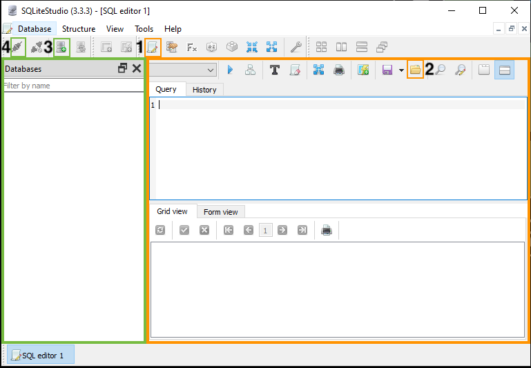
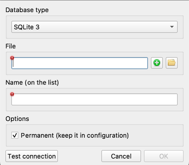

# Database Set Up

## SQLiteStudio

To work with our database, we'll use [SQLiteStudio][]. It's a free, open
source, multi-platform desktop application for browsing SQLite databases and
writing SQL queries.

[SQLiteStudio]: https://sqlitestudio.pl/about/

SQLiteStudio has a number of tools and panes to help you interact with your
data:

You can view databases in the pane outlined in green. You can also write and
run queries in the editor pane outlined in orange.

### Create a Database

We are going to work with a database that has already been created for us. BUT, To learn about how to create your own database from scratch using data stored in CSV files, see:

* [Create a New Database](https://github.com/pawelsalawa/sqlitestudio/wiki/User_Manual#creating-new-database)
* Geeks for Geeks' tutorial for how to [Import a CSV File Into an SQLite Table](https://www.geeksforgeeks.org/import-a-csv-file-into-an-sqlite-table/) - see the "Using SQLStudio" section near the middle of the page.

### Load the Database

Let's connect to the database that we'll be using for this workshop:

1. Click the "Add a database" icon  [**3**] and the *Database Dialog Window* will pop up. 

 
    
2. Click the "Browse for existing database file on your local computer" icon 
    - Your computer file explorer window will pop up
    
3. Navigate to the  `lcdb.db` file on your computer and double-click
    - The *Database Dialog Window* will appear again
    
4. Click the "OK" button  at the bottom right
    - The `lcdb.db` file will load to the left under the *Databases Pane* of the interface (outlined in green)
    
5. Click `lcdb` under the *Databases Pane* to highlight
    - 
    
6. Click the "Connect to the database" icon  [**4**]
    - You are now connected to the database and can execute SQL to the database!

<!-- What are the [3] and [4] for? Also the file isn't called lcdb, so you 
might want to change how you refer to it or change the name of the file -->

### Saving Scripts

You can save a text file with a .sql extension that contains SQL commands to run as a script. Like scripts in other programming languages, the commands run from top to bottom. For today's workshop, writing a script that we have to execute over and over doesn't make sense. We're still learning and we'll need to run individual queries over and over as we correct our mistakes.  For data cleaning tasks that you repeat every time you add new data, for example, these scripts can save a lot of time and make your process repeatable.

